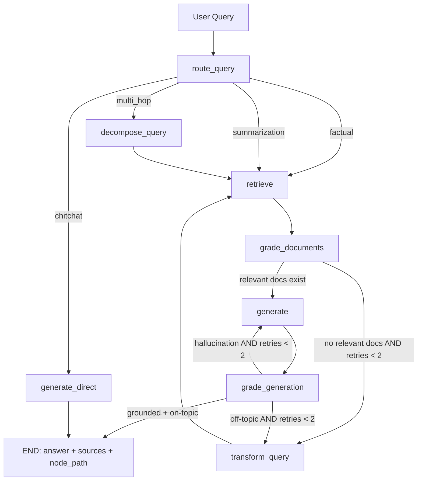

# Enterprise Multi-Agent RAG System — Build Specification for Claude Code

> **Instructions for Claude Code:** Build this project end-to-end, one phase at a time.
> Run the verification step at the end of each phase before moving on.
> Use **LiteLLM** as the single LLM gateway throughout — the user switches any provider
> by changing two env vars (`LLM_MODEL` + the relevant API key) with zero code changes.
> All sample data lives in `data/sample_docs/` — generate it fully, no placeholders.

---

## 1. Project Overview

**Name:** `multi-agent-rag`

**Goal:** A production-grade, self-correcting Multi-Agent RAG system over a realistic
enterprise dataset, demonstrating advanced RAG concepts for an AI/GenAI Engineer portfolio.

**Advanced RAG concepts implemented:**
- LiteLLM gateway — 100+ LLM providers, zero code change to switch
- Adaptive query routing — classify and route queries to specialist strategies
- HyDE — Hypothetical Document Embeddings for dense query expansion
- Hybrid retrieval — dense (vector) + sparse (BM25) with Reciprocal Rank Fusion (RRF)
- Cross-encoder reranking — rerank top-k with a cross-encoder model
- Self-RAG loop — grade docs, grade generation, re-retrieve or rewrite on failure (max 2 retries)
- RAGAS evaluation — faithfulness, answer relevancy, context precision/recall + HTML dashboard
- LangSmith tracing — every node step traced (optional, gated by env var)
- FastAPI streaming + Docker Compose + GitHub Actions CI

---

## 2. Tech Stack

| Layer | Tool | Notes |
|---|---|---|
| LLM gateway | **LiteLLM** `>=1.40.0` | `litellm.acompletion()` everywhere — never call any provider SDK directly |
| Orchestration | **LangGraph** | `StateGraph` for the multi-agent flow |
| LLM default | `ollama/llama3.1:8b` via LiteLLM | Change `LLM_MODEL` env var to switch |
| Embeddings | `sentence-transformers/all-MiniLM-L6-v2` | Local, no API key needed |
| Vector store | **Qdrant** (Docker container) | Hybrid: named `dense` + `sparse` vectors |
| Sparse retrieval | **fastembed** BM25 (Qdrant-native) | |
| Reranker | `cross-encoder/ms-marco-MiniLM-L-6-v2` | CPU-friendly, lazy singleton |
| Tracing | **LangSmith** | Free tier; gated behind `LANGCHAIN_TRACING_V2` |
| Evaluation | **RAGAS** | 20-question golden set |
| API | **FastAPI** + Uvicorn | SSE streaming |
| UI | **Streamlit** | Chat + eval dashboard |
| Containers | **Docker + docker-compose** | services: api, qdrant, ui, optional ollama |
| CI | **GitHub Actions** | ruff, mypy, pytest (offline/mocked), docker build |
| Python | **3.11+**, `uv` preferred | |

---

## 3. LiteLLM Integration — Read Carefully

### The core pattern — use this everywhere an LLM is called

```python
# src/rag/llm.py  — single module, import this everywhere
import litellm
import json
from rag.config import settings

async def call_llm(messages: list[dict], json_mode: bool = False) -> str:
    kwargs: dict = dict(
        model=settings.llm_model,
        messages=messages,
    )
    if settings.llm_api_base:
        kwargs["api_base"] = settings.llm_api_base
    if settings.llm_api_key:
        kwargs["api_key"] = settings.llm_api_key
    if json_mode:
        kwargs["response_format"] = {"type": "json_object"}
    response = await litellm.acompletion(**kwargs)
    return response.choices[0].message.content

async def call_llm_json(messages: list[dict]) -> dict:
    raw = await call_llm(messages, json_mode=True)
    try:
        return json.loads(raw)
    except json.JSONDecodeError:
        # graceful fallback: strip markdown fences if model adds them
        cleaned = raw.strip().removeprefix("```json").removesuffix("```").strip()
        return json.loads(cleaned)

async def stream_llm(messages: list[dict]):
    """Yields string chunks for SSE streaming."""
    kwargs: dict = dict(
        model=settings.llm_model,
        messages=messages,
        stream=True,
    )
    if settings.llm_api_base:
        kwargs["api_base"] = settings.llm_api_base
    if settings.llm_api_key:
        kwargs["api_key"] = settings.llm_api_key
    async for chunk in await litellm.acompletion(**kwargs):
        delta = chunk.choices[0].delta.content
        if delta:
            yield delta
```

### Config (`src/rag/config.py`)

```python
from pydantic_settings import BaseSettings

class Settings(BaseSettings):
    # LiteLLM model string — change this to switch provider
    llm_model: str = "ollama/llama3.1:8b"
    llm_api_base: str | None = None
    llm_api_key: str | None = None

    # Embeddings (always local)
    embed_model: str = "sentence-transformers/all-MiniLM-L6-v2"
    embed_dim: int = 384

    # Qdrant
    qdrant_url: str = "http://localhost:6333"
    qdrant_collection: str = "axonify_docs"

    # LangSmith (optional)
    langchain_tracing_v2: bool = False
    langchain_api_key: str | None = None
    langchain_project: str = "multi-agent-rag"

    log_level: str = "INFO"
    cache_ttl_seconds: int = 3600

    class Config:
        env_file = ".env"

settings = Settings()
```

### Provider switching table — document in README and .env.example

| Provider | `LLM_MODEL` | Extra env var |
|---|---|---|
| Ollama (local) | `ollama/llama3.1:8b` | `LLM_API_BASE=http://localhost:11434` |
| Ollama (in docker) | `ollama/llama3.1:8b` | `LLM_API_BASE=http://host.docker.internal:11434` |
| OpenAI | `gpt-4o-mini` | `OPENAI_API_KEY=sk-...` |
| Anthropic | `anthropic/claude-haiku-3-5` | `ANTHROPIC_API_KEY=sk-ant-...` |
| Groq (free) | `groq/llama-3.1-8b-instant` | `GROQ_API_KEY=gsk_...` |
| Google Gemini | `gemini/gemini-1.5-flash` | `GEMINI_API_KEY=...` |
| Mistral | `mistral/mistral-small` | `MISTRAL_API_KEY=...` |
| Together AI | `together_ai/meta-llama/Llama-3.1-8B-Instruct-Turbo` | `TOGETHERAI_API_KEY=...` |

> LiteLLM reads all provider API keys from environment automatically.
> Never import openai, anthropic, groq, etc. directly — always go through litellm.

---

## 4. Repository Structure

```
multi-agent-rag/
├── README.md
├── PROJECT_SPEC.md
├── .env.example
├── pyproject.toml
├── docker-compose.yml
├── Dockerfile
├── .github/
│   └── workflows/
│       └── ci.yml
├── data/
│   └── sample_docs/
│       ├── 01_company_overview.md
│       ├── 02_product_catalog.md
│       ├── 03_api_documentation.md
│       ├── 04_security_compliance.md
│       ├── 05_architecture_decisions.md
│       ├── 06_incident_postmortem.md
│       ├── 07_engineering_handbook.md
│       ├── 08_pricing_contracts.md
│       ├── 09_customer_onboarding.md
│       ├── 10_hr_policies.md
│       ├── 11_data_pipeline_runbook.md
│       └── 12_quarterly_review_q3_2024.md
├── src/
│   └── rag/
│       ├── __init__.py
│       ├── config.py
│       ├── llm.py                  # single LiteLLM wrapper — import this everywhere
│       ├── ingestion/
│       │   ├── __init__.py
│       │   ├── loaders.py
│       │   ├── chunking.py
│       │   └── indexer.py
│       ├── retrieval/
│       │   ├── __init__.py
│       │   ├── embedder.py         # sentence-transformers singleton
│       │   ├── hyde.py
│       │   ├── hybrid.py
│       │   ├── reranker.py
│       │   └── router.py
│       ├── agents/
│       │   ├── __init__.py
│       │   ├── state.py
│       │   ├── graph.py
│       │   ├── nodes.py
│       │   └── prompts.py
│       ├── evaluation/
│       │   ├── __init__.py
│       │   ├── golden_set.py
│       │   ├── run_ragas.py
│       │   └── report.py
│       └── api/
│           ├── __init__.py
│           ├── main.py
│           └── schemas.py
├── ui/
│   ├── app.py
│   └── Dockerfile.streamlit
├── tests/
│   ├── conftest.py
│   ├── test_chunking.py
│   ├── test_rrf.py
│   ├── test_router.py
│   ├── test_graph_flow.py
│   └── test_api.py
├── scripts/
│   ├── ingest.py
│   └── ask.py
└── results/
    └── .gitkeep
```

---

## 5. Sample Data — Axonify Corp (generate ALL 12 files completely, no placeholders)

**Company:** Axonify Corp — B2B SaaS, AI-powered employee learning & knowledge retention
platform for enterprise customers (retail, logistics, healthcare, finance verticals).
Founded 2019, Waterloo Ontario. 320 employees, 180 enterprise customers,
4.2M learners on platform, $42M ARR, Series C $65M led by Sequoia Canada.

Names and numbers must be consistent across all files. Every file must be fully written out.

---

### `01_company_overview.md` (target: ~700 words)

Write a polished company overview document covering all of the following:

**Mission & tagline:** "Axonify helps frontline workforces Learn → Retain → Perform through
AI-powered microlearning that adapts to every individual." Mission is to make learning
a daily habit for the 2.7 billion deskless workers worldwide.

**Founding story:** Priya Mehta (CEO) and James Okonkwo (CTO) met at the University of
Waterloo's AI lab in 2017. Priya had been researching spaced-repetition cognition science;
James was building distributed systems. They saw that enterprise LMS tools were massive,
expensive, and rarely opened. They launched Axonify in 2019 with a single hypothesis:
3-minute daily sessions beat 3-hour annual compliance courses.

**Key metrics (as of Q3 2024):**
- 320 employees across 4 offices
- 180 enterprise customers
- 4.2 million active learners on the platform
- 94% annual customer retention rate
- $42.1M ARR, 31% YoY growth
- Series C: $65M raised, led by Sequoia Canada, with participation from OMERS Ventures
  and BDC Capital (closed January 2024)

**Offices:** Waterloo HQ (180 employees), Toronto (55), Austin TX (50), London UK (35)

**Leadership team:**
- Priya Mehta, CEO — former ML researcher, Forbes 30 Under 30 2022
- James Okonkwo, CTO — ex-Google SRE, holds 3 patents in distributed ML inference
- Sofia Reyes, VP Engineering — ex-Shopify, joined 2021, scaled eng team from 18 to 79
- Daniel Park, VP Product — ex-Duolingo, joined 2022, introduced gamification layer
- Marcus Webb, VP Sales — ex-Salesforce, joined 2023, signed 23 enterprise logos in Q3 2024 alone
- Natasha Iyer, CFO — ex-Deloitte, joined 2023, led Series C process

**Company values:**
1. Curiosity — we ask why before we ask how
2. Rigor — we trust evidence over intuition
3. Impact — we measure everything against learner outcomes
4. Trust — we earn it slowly and protect it fiercely

**Awards & recognition:** Deloitte Technology Fast 50 Canada 2023 (ranked #14),
G2 Learning Management Leader Winter 2024, Brandon Hall Excellence Award 2023 (Best Advance in
Learning Technology), Waterloo Region Top Employer 2024.

**Investors & board:** Sequoia Canada (lead, Series C), OMERS Ventures (Series B lead),
BDC Capital, and two angels: Dr. Ebbinghaus Foundation (named after the forgetting-curve
researcher whose work underpins the SRE algorithm).

---

### `02_product_catalog.md` (target: ~850 words)

Write a complete product catalog document covering:

**Product 1 — Axonify Learn (core product)**
The adaptive microlearning engine. Key capabilities:
- Daily 3–5 minute learning sessions delivered via web or mobile app (iOS + Android)
- AI-driven Spaced Repetition Engine (SRE) personalizes question sequencing per learner
  using a modified Ebbinghaus forgetting curve with 14 decay parameters
- Gamification layer: streaks, leaderboards, badges, points, weekly challenges
- Content types: multiple choice, true/false, image-based, video (max 2 min), scenario-based,
  fill-in-the-blank, drag-and-drop ranking, binary swipe — 40+ question types total
- 34 supported languages (added Arabic + Hebrew in Q3 2024)
- Offline mode: in progress, targeting Q4 2024 mobile release
- Accessibility: WCAG 2.1 AA compliant

**Product 2 — Axonify Insights (analytics)**
The intelligence layer for managers and L&D teams. Key capabilities:
- Real-time knowledge gap heatmaps by department, location, topic, or individual
- AI-powered predictions: flags learners at risk of knowledge decay before assessments
- Manager coaching recommendations: "Sarah in checkout shows a gap in food safety — assign module X"
- Custom report builder: 15 pre-built templates + drag-and-drop custom reports
- Integrations for HRIS data: Workday, SAP SuccessFactors, BambooHR (bi-directional sync)
- Executive dashboard: NPS, completion rates, compliance status, ROI estimator

**Product 3 — Axonify Connect (communications)**
The communications module, available on Business and Enterprise tiers. Key capabilities:
- Push notifications to learner mobile apps (segmented by role, location, department)
- Digital newsletter builder (drag-and-drop, 12 templates)
- Task assignment and acknowledgment tracking (e.g., "Read updated COVID protocol and confirm")
- Two-way pulse surveys (5-question max, 48-hour window)
- Emergency broadcast: push + email + SMS simultaneously (Enterprise only)

**Integration Ecosystem:**
- HRIS: Workday, SAP SuccessFactors, BambooHR (SSO + learner sync)
- Collaboration: Slack (learning nudges in channels), Microsoft Teams (embedded learning tab)
- LMS standards: SCORM 1.2, SCORM 2004, xAPI/TinCan, AICC
- Auth: SAML 2.0, OIDC/OAuth2 (tested with Okta, Azure AD, Ping Identity, OneLogin)
- Data export: CSV, JSON, xAPI statements to LRS

**Platform architecture note:** All three products share a single learner identity layer
and tenant data model. Customers on all tiers get a branded subdomain (`learn.customer.com`)
and can white-label the mobile app on Enterprise tier.

---

### `03_api_documentation.md` (target: ~950 words)

Write complete REST API v2 documentation. Style: similar to Stripe or Twilio docs.

Base URL: `https://api.axonify.com/v2`
Authentication: OAuth2 client credentials → Bearer JWT (expires 1h)
All responses: `Content-Type: application/json`
Pagination: cursor-based, `next_cursor` field in response

Document these endpoints with method, path, description, parameters, and sample JSON:

1. `POST /auth/token` — get access token
   Body: `{client_id, client_secret, grant_type: "client_credentials"}`
   Response: `{access_token, token_type: "bearer", expires_in: 3600}`

2. `GET /learners` — list learners
   Query params: `department`, `location`, `status` (active|inactive|pending),
   `cursor`, `limit` (max 200, default 50)
   Response: `{data: [{id, email, first_name, last_name, department, location, status,
   enrolled_at, last_active_at}], next_cursor, total_count}`

3. `POST /learners` — create learner
   Body: `{email, first_name, last_name, department, location, role, external_id}`
   Response: `{id, ...learner fields, created_at}`

4. `PUT /learners/{id}` — update learner (partial update supported)

5. `GET /learners/{id}/progress` — learner progress detail
   Response: `{learner_id, overall_knowledge_score, streak_days, total_sessions,
   module_progress: [{module_id, module_name, completion_pct, last_score, next_due_at}]}`

6. `POST /content/modules` — upload SCORM package
   Multipart form: `file` (zip, max 500MB) + `title`, `language`, `tags[]`
   Response: `{module_id, title, status: "processing", estimated_ready_in_seconds: 120}`

7. `GET /analytics/knowledge-gaps` — knowledge gap report
   Query params: `date_from`, `date_to`, `department`, `topic_id`, `threshold` (0.0–1.0, default 0.6)
   Response: `{gaps: [{topic_id, topic_name, department, avg_score, learners_below_threshold,
   recommended_action}], generated_at}`

8. `POST /notifications/push` — send push notification
   Body: `{title, body, segment: {departments[], locations[], learner_ids[]},
   action_url, schedule_at}` (schedule_at optional, ISO 8601)
   Response: `{notification_id, recipients_count, status: "queued"}`

9. `GET /reports/completion` — export completion report
   Query params: `date_from`, `date_to`, `format` (json|csv), `department`
   CSV response has columns: learner_id, name, email, department, module_name,
   completion_date, score, time_spent_seconds

Rate limits: 1000 req/min per tenant. Response headers: `X-RateLimit-Remaining`, `X-RateLimit-Reset`

Webhooks: register at `POST /webhooks`. Events: `learner.completed` (module done),
`learner.streak_broken` (missed a day), `knowledge_gap.detected` (score drops below threshold).
Webhook payload: `{event_type, tenant_id, timestamp, data: {...event-specific fields}}`

Error format: `{error: {code: "LEARNER_NOT_FOUND", message: "No learner with id xyz",
request_id: "req_abc123"}}` with appropriate HTTP status code.

SDKs: Python (`pip install axonify-sdk`), Node.js (`npm install @axonify/sdk`), Java (Maven).

---

### `04_security_compliance.md` (target: ~780 words)

Write a formal security and compliance document covering:

**Certifications & compliance status:**
- SOC 2 Type II: certified (initial audit 2022, renewal 2024 by Deloitte, covers Security,
  Availability, and Confidentiality trust principles)
- GDPR: fully compliant since 2021, DPA available on request, EU data residency option
- CCPA: compliant, privacy policy updated Q1 2024
- ISO 27001: in progress, target certification Q2 2025 (gap assessment completed Oct 2024)
- FedRAMP Moderate: in progress for US government customers, target authorization Q3 2025
- PIPEDA (Canada): compliant

**Encryption:**
- At rest: AES-256 on all databases (RDS PostgreSQL, TimescaleDB) and S3 buckets
- In transit: TLS 1.3 enforced; TLS 1.0/1.1 deprecated and blocked
- Backups: encrypted with customer-managed keys (CMK) option on Enterprise tier

**Data residency:** US (AWS us-east-1 + us-west-2), EU (AWS eu-west-1 Frankfurt),
Canada (AWS ca-central-1). Residency selected at tenant provisioning; cannot change post-signup.

**Access control:**
- RBAC with 5 default roles: Super Admin, Tenant Admin, Manager, Content Author, Learner
- SSO: SAML 2.0 and OIDC/OAuth2 (Okta, Azure AD, Ping Identity, OneLogin tested)
- MFA: enforced for all Admin and Manager roles; optional for Learners (configurable)
- Principle of least privilege enforced in IAM; quarterly access reviews

**Network security:**
- WAF (AWS WAF) on all public endpoints, OWASP Top 10 ruleset + custom rules
- DDoS protection: AWS Shield Standard (Shield Advanced on Enterprise)
- VPC isolation per environment (dev/staging/prod); no public database endpoints
- Secrets management: AWS Secrets Manager, rotated every 90 days

**Penetration testing:**
- Annual third-party pen test by CrowdStrike (most recent: October 2023)
- Results of Oct 2023 test: 0 critical findings, 2 high (both remediated within 14 days),
  7 medium (all remediated within 30 days), 4 low (in backlog)
- Bug bounty program: HackerOne private program, scope includes api.axonify.com and app.axonify.com

**Incident response SLA:**
- P0 (full outage, data breach risk): 30-minute response, 4-hour resolution target
- P1 (partial outage, significant degradation): 2-hour response, 8-hour resolution target
- P2 (minor degradation, workaround available): 8-hour response, 24-hour resolution target
- Post-mortems published internally for P0/P1; see INC-2024-0312 for the company's only P0

**Data retention:**
- Learner event data: 7 years (regulatory requirement for some customers)
- Application logs: 90 days (CloudWatch), 1 year (S3 cold archive)
- Backups: daily snapshots retained 30 days, weekly retained 1 year
- On contract termination: 30-day window for customer data export; data deleted within 60 days

**Vendor management:** All third-party vendors assessed annually (SOC 2 report review).
Critical vendors: AWS (infrastructure), Datadog (monitoring), PagerDuty (alerting),
Okta (internal SSO), HackerOne (bug bounty), Deloitte (audit).

---

### `05_architecture_decisions.md` (target: ~900 words)

Write three complete Architecture Decision Records (ADRs) in standard ADR format
(Status, Context, Decision, Consequences):

**ADR-001 — Migrate from MongoDB to PostgreSQL + TimescaleDB (March 2021)**
Status: Implemented
Context: In 2020, Axonify ran all learner data (profiles, progress, event logs) on MongoDB 4.2.
As the customer count grew from 12 to 80, a cluster of bugs emerged: progress saves were
occasionally lost during network partitions (MongoDB's eventual consistency), and multi-document
transactions were fragile under load. An incident in November 2020 caused 3 enterprise customers
to lose 2 weeks of learner progress data (the company's first major data loss, before INC-2024-0312).
Decision: Migrate relational data (learners, tenants, modules, assignments) to PostgreSQL 14.
Use the TimescaleDB extension for time-series event logs (learner actions, session events)
because hypertables offer 10x compression and native time-bucket queries vs plain Postgres.
Keep MongoDB only for content metadata (module JSON, question bank) where document flexibility
is genuinely useful.
Migration: 3-month project (Jan–Mar 2021), zero data loss, dual-write pattern during transition.
Consequences: +40% average query performance on progress APIs. ACID guarantees eliminated the
progress-loss bug class. TimescaleDB compression reduced storage costs 68%. Trade-off: two
database technologies to maintain, higher DBA expertise required.

**ADR-012 — Event-Driven SRE with Apache Kafka (July 2023)**
Status: Implemented (Q4 2023)
Context: The Spaced Repetition Engine (SRE) computed personalized question schedules synchronously
per API request. With >5,000 concurrent learners during peak (retail morning shifts), the
synchronous SRE computation added 680ms average latency to the `/next-question` API endpoint,
causing session abandonment. Horizontal scaling of SRE workers was blocked by a shared-state
design (Redis locks on learner schedules creating contention).
Decision: Refactor SRE to event-driven. Three Kafka topics:
  - `sre.schedule.requested` — API publishes a request when a learner starts a session
  - `sre.schedule.computed` — SRE worker publishes the computed schedule
  - `sre.result.delivered` — delivery confirmation for observability
SRE workers: Python with confluent-kafka, autoscaled on ECS Fargate (2–20 instances based on
consumer lag metric). Pre-computation: SRE schedules next session during current session (not on demand).
Consequences: p95 API latency dropped from 820ms to 140ms under peak load. Consumer lag became
the new scaling signal. RISK REALIZED: retention policy misconfiguration in INC-2024-0312 caused
Kafka disk exhaustion — see postmortem. Mitigated by ADR-012-addendum: DLQ + exponential backoff
added to all SRE consumers; disk alerts added to Kafka brokers.

**ADR-019 — RAG-Based Contextual Help in Axonify Learn (April 2024)**
Status: In Progress (Q4 2024 target)
Context: Between Q1 2023 and Q1 2024, "how do I use X" support tickets increased 35% as the
product surface area grew (Insights module, Connect module, new API endpoints). The support
team handles ~320 tickets/week, 38% of which are answerable by existing documentation.
CSM team spends 4 hours/week per customer on onboarding questions that could be self-served.
Decision: Build an internal RAG system indexed over product docs, help articles, API docs,
onboarding guides, and customer-specific configuration. Embed as a chat widget in the Axonify
Learn admin portal. Use retrieval-augmented generation with a self-correction loop to minimize
hallucinations. Weekly re-index pipeline to keep docs fresh.
Risks: (1) Hallucination — mitigated by RAGAS evaluation suite run weekly, faithfulness
threshold 0.75 required before each release. (2) Doc freshness — mitigated by automated
re-index on doc update events. (3) Data isolation — each customer sees only their own
config data plus global product docs (tenant-aware retrieval filter in Qdrant).
Consequences: Expected: 20% reduction in "how do I" support tickets (Q4 OKR). Effort: 1 ML
engineer + 0.5 backend engineer for 12 weeks. This project (the multi-agent-rag repo)
is the reference implementation for ADR-019.

---

### `06_incident_postmortem.md` (target: ~850 words)

Write a formal post-mortem document for this incident:

**Incident ID:** INC-2024-0312
**Severity:** P0
**Title:** Kafka Broker Disk Exhaustion — Analytics Dashboard Outage
**Date:** March 12, 2024
**Duration:** 5 hours 25 minutes (14:22 UTC to 19:47 UTC)
**Impact:** 47 enterprise customers unable to view analytics dashboards or knowledge gap reports.
Learner progress events backlogged (no data loss — events queued in Kafka and replayed).
No learner-facing outage (the learning experience itself was unaffected).
Affected revenue risk: ~$8.4M ARR (26% of customer base impacted).

**Timeline:**
14:22 — Automated monitoring detects analytics API returning 504s; PagerDuty fires P0 alert
14:35 — On-call SRE Marco Silva acknowledges; begins investigation
14:52 — Marco identifies Kafka cluster CPU at 100%; consumer lag growing exponentially
15:10 — Identifies Kafka broker `axonify-kafka-broker-2` disk at 99.8% (1.2 GB free of 500 GB)
15:45 — Marco pauses SRE consumer group `sre-scheduler-v2` to stop message production
16:20 — Root cause confirmed: SRE worker bug introduced in deploy `v2.14.2` (March 11)
         caused infinite retry loop, producing 2.8M duplicate messages in 3 hours on topic
         `sre.schedule.computed`. Topic retention policy: `log.retention.bytes=-1` (unlimited)
         allowed the disk to fill completely
17:30 — Retention policy patched to 20 GB; oldest segments deleted; 180 GB freed
17:45 — Kafka brokers healthy; consumer groups restarted with fixed `v2.14.3` worker
19:47 — Consumer lag cleared; analytics dashboards fully restored; P0 resolved
20:15 — Customer communication sent to all 47 affected tenants (email + status page update)

**Root Cause:**
Primary: A loop condition bug in `sre_worker/scheduler.py:compute_schedule()` introduced
in PR #1847 (merged March 11, approved by author + 1 reviewer). The retry condition
`while result is None` failed to check a max-retry counter, creating an infinite loop
when the downstream database returned an intermittent `None` for a new learner's initial schedule.
Contributing factor 1: Kafka topic retention policy `log.retention.bytes=-1` was inherited
from the development configuration and never overridden in production.
Contributing factor 2: No disk-space monitoring alert on Kafka brokers (only CPU and lag were
alerting).
Contributing factor 3: The infinite loop bypassed the circuit breaker because the circuit breaker
wrapped the DB call, not the retry loop itself.

**Action Items:**
- [AI-1] Add Kafka broker disk space alert at 70% threshold in Datadog
  Owner: Marco Silva | Due: 2024-03-20 | Status: DONE
- [AI-2] Add exponential backoff + max 5 retries + dead-letter-queue (`sre.schedule.dlq`)
  to all SRE worker consumers. DLQ messages trigger a PagerDuty P2 alert.
  Owner: Aisha Patel (SRE worker team) | Due: 2024-04-05 | Status: DONE
- [AI-3] Set `log.retention.bytes=20GB` and `log.retention.ms=604800000` (7 days) on all
  production Kafka topics as IaC default (Terraform). Audit all topics for unlimited retention.
  Owner: Marco Silva | Due: 2024-03-25 | Status: DONE
- [AI-4] Add PR checklist item: "Does this change affect retry logic? If yes, ensure max-retry
  counter and backoff are present."
  Owner: Sofia Reyes (VP Eng) | Due: 2024-04-01 | Status: DONE
- [AI-5] Chaos engineering drill: simulate Kafka broker disk exhaustion in staging
  Owner: DevOps team | Due: 2024-06-01 | Status: IN PROGRESS

**What went well:**
- PagerDuty alert fired within 7 minutes of first 504 (monitoring coverage was good at the API layer)
- On-call runbook was clear enough for Marco to isolate the Kafka layer within 35 minutes
- No data loss due to Kafka's durability guarantees
- Customer communication was sent within 30 minutes of resolution (met P0 SLA)

**Lessons learned:**
Infrastructure configuration drift between dev and prod is a high-risk failure mode.
All Kafka configuration must be managed as IaC with explicit production overrides.
Retry logic must always have a bounded exit condition; unbounded retries are a system reliability risk.
The circuit breaker placement was too narrow — wrap the entire operation including retry loops.

---

### `07_engineering_handbook.md` (target: ~950 words)

Write a comprehensive engineering handbook covering:

**Welcome & Culture:**
Axonify Engineering operates on three principles: (1) we ship working software over perfect
software, (2) we automate toil before complaining about it, (3) we write things down
(RFCs, ADRs, runbooks) because the person on-call at 2am might not be you.

**Onboarding Checklist (Week-by-Week):**
Week 1: Laptop setup (MacBook Pro M3 or Linux of choice), install Homebrew/apt,
Docker Desktop, Python 3.11 via `pyenv`, Node 20 via `nvm`, `uv` for Python package management.
Clone all repos. Complete security training (1.5h mandatory Axonify Learn module).
Meet your buddy (assigned from your team). No PRs in week 1 — read code and ask questions.
Week 2: First good-first-issue PR. Attend team sprint planning and retrospective.
Set up local dev environment for your team's primary service using `docker compose up`.
Week 3: Own a small feature end-to-end (design → implement → test → deploy to staging).
Week 4: Complete on-call shadowing shift. Present your first month learnings at Friday demos.

**Development Environment:**
- Python: always use `uv` (`pip install uv`). `uv sync` to install from `pyproject.toml`.
- Pre-commit hooks (install with `pre-commit install`): ruff (lint + format), mypy (type check),
  pytest (run affected tests), detect-secrets (no credentials in code)
- All services runnable locally via `docker compose up` from repo root
- Secrets: never in code or `.env` files committed to git. Use `.env.example` as template.
  Load from AWS Secrets Manager in production; devs use 1Password CLI locally.

**Git Workflow (GitHub Flow):**
1. Create feature branch from `main`: `git checkout -b feat/AXON-1234-short-description`
2. Commits: conventional commits format (`feat:`, `fix:`, `chore:`, `docs:`)
3. Open PR: use the PR template (bug/feature/chore/adr sections). Self-review first.
4. Required: 2 approvals (at least 1 from a senior engineer on the team), all CI checks green,
   no unresolved comments.
5. Merge: squash merge to keep linear history. Delete branch after merge.
6. No direct commits to `main`. Branch protection enforced.

**Coding Standards:**
- Type hints mandatory on all function signatures. Use `from __future__ import annotations` for forward refs.
- Pydantic v2 for all config, request/response models, and structured LLM outputs.
- No `print()` in production code — use `structlog.get_logger()`.
- All LLM calls via the `rag.llm` module (see config spec) — never import `openai` directly.
- Error handling: catch specific exceptions, not bare `except`. Log with context. Never swallow errors silently.
- Code coverage: minimum 80% enforced in CI. `pytest --cov=src --cov-fail-under=80`

**RFC Process:**
Any feature requiring >3 engineer-days of work requires an RFC (Request for Comments).
RFC template in Notion: problem statement, proposed solution, alternatives considered,
open questions, rollout plan, success metrics. RFC review: 48-hour comment window,
then author calls a decision. ADR created for infrastructure/architecture decisions.

**Testing Philosophy:**
- Unit tests: pure functions, mocked dependencies. Fast (<1ms each).
- Integration tests: test real component interactions (e.g., FastAPI TestClient + in-memory Qdrant).
- Contract tests: API contract tests using Pact for inter-service calls.
- No end-to-end tests in CI (too slow/flaky); run nightly in staging.
- When in doubt: test the behavior, not the implementation.

**Deployment Process:**
1. PR merged to `main` → GitHub Actions CI runs (lint, typecheck, test, docker build)
2. On CI green: automatic deploy to `staging` environment (ECS Fargate, blue-green)
3. Staging smoke tests run automatically (5-minute suite)
4. Production deploy: manual trigger from GitHub Actions (requires VP Eng approval for P0-risk changes)
5. Blue-green deploy: traffic shifts 10% → 50% → 100% over 10 minutes with auto-rollback on error rate >1%
6. Rollback: `aws ecs update-service --task-definition <previous>` — achieves rollback in <5 minutes

**Monitoring & Alerting:**
- APM: Datadog (traces, metrics, logs)
- Alerts: PagerDuty for P0/P1 (phone call), Slack #alerts for P2/P3
- Infrastructure: Grafana dashboards for Kafka lag, Qdrant indexing latency, API p99
- On-call: weekly rotation, every engineer after 6 months tenure. Runbooks in Notion + PagerDuty.
- Post-incident: all P0/P1 get a written post-mortem within 5 business days.

---

### `08_pricing_contracts.md` (target: ~720 words)

Write a formal pricing and commercial terms document covering:

**Three Pricing Tiers:**

Starter — $8/learner/month (minimum 500 learners, billed annually)
Includes: Axonify Learn only, up to 10 active content modules, standard analytics (pre-built
reports only), email support (48h response SLA), SSO (SAML 2.0), 99.5% uptime SLA,
US or Canada data residency, standard SCORM import, Axonify mobile app (shared branded).

Business — $12/learner/month (minimum 1,000 learners, billed annually)
Includes everything in Starter plus: Axonify Insights (full analytics + knowledge gap heatmaps),
unlimited content modules, REST API access (1,000 req/min), dedicated Customer Success Manager
(monthly business reviews), 99.9% uptime SLA, choice of US/EU/Canada data residency,
BambooHR/Workday/SAP SuccessFactors HRIS sync, Slack + Teams integrations, MSA + DPA required.

Enterprise — Custom pricing (minimum 5,000 learners, multi-year preferred)
Includes everything in Business plus: Axonify Connect (communications module), custom integrations
(professional services hours included), 99.95% uptime SLA with financial penalties for breach,
dedicated infrastructure option (single-tenant VPC), on-premise deployment option (additional
licensing fee), FedRAMP Moderate option (when authorized, Q3 2025 target), white-label mobile app,
24/7 phone support, executive business reviews (quarterly), emergency broadcast feature.

**Contract Terms:**
Annual billing: 100% upfront. Multi-year discount: 5% per additional year (max 3-year term).
Example: 2,000 learners on Business tier, 3-year: $12 × 2,000 × 12 months = $288,000/year,
less 10% multi-year discount = $259,200/year.
Seat overage: $0.50/learner/month for seats above contracted volume, billed monthly in arrears.
Seat reduction: permitted at renewal only, not mid-term.

**Refund Policy:**
Starter: 30-day money-back guarantee from contract start date, no questions asked.
Business & Enterprise: No refund after 60 days from contract start. Pro-rated refund for
termination within days 31–60. Termination for cause (Axonify material breach, uncured within
30 days): full remaining-term refund.

**Data Export on Termination:**
30-day data export window from contract end date. Formats: CSV (learner data, completion records)
and xAPI statements (full event log). After 60 days, data deleted per security policy §Data Retention.

**SLA Credits:**
Uptime below SLA triggers service credits (not cash refunds): 99.0–99.5% → 10% monthly credit,
98.0–99.0% → 25% monthly credit, below 98.0% → 50% monthly credit. Credits applied to next invoice.
Credit claims must be submitted within 30 days of the incident via support portal.

**Professional Services (Enterprise):**
Content development: $175/hour, minimum 20-hour engagement.
Custom integration development: $200/hour, scoped and fixed-fee preferred.
On-site training: $3,500/day plus travel expenses.
Implementation package (included in Enterprise): 40 hours.

---

### `09_customer_onboarding.md` (target: ~780 words)

Write a detailed customer onboarding guide covering the full journey:

**Pre-Kickoff (T-7 days):**
Once contract signed, Axonify provisioning team creates tenant in 24 hours.
Customer Success Manager (CSM) sends Welcome Kit: admin credentials, technical requirements
checklist, SSO configuration guide, learner data CSV template.
Technical requirements: SSO provider details (entity ID, metadata URL), IP ranges for whitelist
(if applicable: 52.204.x.x, 52.206.x.x, 54.147.x.x), HRIS system for sync, list of departments
and locations for hierarchy setup.

**Kickoff Call (Day 0):**
90-minute call with: Axonify CSM, Implementation Specialist, customer L&D lead, IT lead.
Agenda: product tour, SSO configuration (live), success metrics definition, project plan review.
Deliverable: signed project plan with milestones, admin training scheduled.

**Week 1 — Tenant Setup:**
Infrastructure provisioned via Terraform (automated): S3 bucket, RDS schema, tenant record,
API credentials. Custom domain configured: `learn.customername.com` (CNAME to Axonify CDN).
Branding: customer logo (SVG, min 200px), primary color (hex), secondary color.
SSO integration tested and confirmed. Admin accounts created. IP whitelist configured if required.

**Week 2 — Content & Learner Setup:**
Content migration: customer provides SCORM packages or existing training materials.
Axonify content team builds 5 starter microlearning modules (included in all tiers) from
provided materials; delivery within 5 business days.
Learner bulk upload: CSV with fields (email, first_name, last_name, department, location, role,
external_id) — max 50,000 rows per upload. Or HRIS auto-sync configured (Workday/SAP/BambooHR).
Department/location hierarchy created to match customer org chart.
Manager role assignments reviewed with customer.

**Week 3 — Pilot Launch:**
Pilot group: 50–500 learners from one department or location.
CSM creates pilot launch checklist: push notification sent, manager briefing deck provided,
learner communication templates (email + Slack/Teams).
Baseline knowledge gap report generated: shows starting knowledge scores by topic.
CSM check-in: 30-minute call on Day 5 of pilot to review engagement metrics.
Target pilot metrics: DAU/MAU ≥30%, session completion rate ≥80%, ≥1 session per learner.

**Week 4 — Full Launch:**
If pilot metrics met: full learner population enrolled (phased by location if >10,000 learners).
Manager training webinar: 45-minute live session covering Insights dashboard and coaching recommendations.
Reporting cadence agreed: Enterprise = monthly dashboard review call; Business = quarterly.
Launch communication: Axonify CSM provides email templates, announcement slide deck, FAQ doc.

**Day 90 — Success Review:**
NPS survey sent to all admin users and a sample of learners (max 200).
Knowledge retention improvement report: compares baseline (Week 3) vs Day 90 scores.
Success metrics review against targets agreed at kickoff.
Expansion conversation: additional departments, Connect module, language rollout.

**Ongoing Success Metrics Axonify Tracks Per Customer:**
- DAU/MAU ratio (target >40%; below 25% triggers at-risk flag)
- Average session completion rate (target >85%)
- Knowledge retention score improvement at 30/60/90 days (target +15% vs baseline)
- Streak maintenance rate (% learners with 5-day streak in past 30 days)

**At-Risk Playbook:**
Triggered when DAU/MAU <25% for 2 consecutive weeks OR NPS <40 OR renewal risk flagged by CSM.
Steps: CSM escalation call within 48h, executive sponsor email from Axonify VP Sales,
Axonify Insights deep-dive to identify engagement drop cause, joint action plan with 30-day
check-in. If unresolved in 60 days: escalate to VP Customer Success.

---

### `10_hr_policies.md` (target: ~720 words)

Write a formal HR policies document covering:

**Time Off — by Region:**
Canada (Waterloo + Toronto): 15 days PTO (accrued from day 1), 10 sick days, 6 personal days.
PTO carries over max 5 days to next year; remainder forfeited. Statutory holidays: Ontario calendar.
UK (London): 25 days PTO + all UK public bank holidays. Sick leave: statutory SSP + Axonify tops up
to full salary for 20 days/year. No carry-over cap.
US (Austin): Unlimited PTO with a 10-day minimum use requirement. Managers approve plans;
Finance tracks actuals to prevent zero-use outliers. Sick leave: 10 days separate.

**Parental Leave:**
Primary caregiver: 18 weeks at 100% salary, globally (top-up over statutory).
Secondary caregiver: 8 weeks at 100% salary, globally.
Adoption: same as birth policy. Miscarriage/loss: 2 weeks leave, no documentation required.
Return-to-work: phased return option (50% for 4 weeks) available on request.

**Remote Work Policy:**
Hybrid (default): 2 days in-office per week for Waterloo, Toronto, Austin, London offices.
Office days coordinated by team (not company-mandated days). Hot-desking available.
Fully remote: permitted with VP-level approval. Remote employees in same timezone band as team
preferred. Remote work outside home country: max 90 days/year (tax compliance).
Home office setup: $1,000 one-time stipend (new hires), $500 refresh every 3 years.

**Travel & Expense Policy:**
Flights: economy class for flights under 4 hours; business class permitted for 4+ hours
with manager approval. Book 14+ days in advance.
Hotels: maximum $250 CAD/night in Canada, $250 USD/night in US, £200/night in UK.
Meals: $75 CAD/day (Canada), $75 USD/day (US), £60/day (UK) — receipts required over $25.
Ground transport: Uber/Lyft reimbursed; personal vehicle at $0.68 CAD/km (Canada), IRS rate (US).
All expenses submitted within 30 days of incurrence via Expensify.

**Performance Review Cycle:**
Bi-annual reviews: June (mid-year calibration) and December (annual).
Process: self-assessment → manager assessment → calibration session (managers + VP) → feedback meeting.
Rating scale: Exceeds (top 15%), Meets (70%), Developing (10%), Below (5%). No forced curve.
OKRs set at company level (CEO) → department → individual at start of each half.
Promotions: decided at December review; effective February 1. Mid-cycle promotions for exceptional cases.

**Compensation Philosophy:**
Target 65th percentile of market (Radford survey data, refreshed annually).
Annual compensation bands reviewed every January; adjustments effective March 1.
Merit increases: average 4% in 2024 (range 0–10% based on performance rating).
Equity: RSUs, 4-year vesting with 1-year cliff. New hire grants based on level and role.
Refresher grants at year 3 for performers rated Meets or above (25% of original grant).

**Benefits Summary by Region:**
Canada: Extended health (vision, dental, paramedical $1,500/year), $500 wellness allowance,
Group RRSP with 4% employer match, Employee Assistance Program (EAP).
US: Medical (Blue Cross Blue Shield, 90% employer premium), dental, vision, 401(k) with
4% employer match vested immediately, $500 wellness allowance, EAP.
UK: Private medical insurance (BUPA), dental (voluntary), pension (5% employer contribution,
3% employee minimum), £400 wellness allowance, EAP.
All regions: $2,000/year learning & development budget (courses, conferences, books),
Axonify platform access for personal learning goals.

---

### `11_data_pipeline_runbook.md` (target: ~880 words)

Write a detailed operational runbook for the Axonify Data Platform team:

**Pipeline Architecture Overview:**
Raw learner events (clicks, session starts, question answers, completions) are emitted by the
Axonify Learn application to Kafka topic `learner.events.raw` (partitioned by tenant_id, 48 partitions).
From there:

```
learner.events.raw (Kafka)
  → Flink stream job: validates, enriches, deduplicates
  → learner.events.normalized (Kafka)
     → TimescaleDB hypertable: learner_events (hot, last 90 days)
     → S3 Parquet: s3://axonify-datalake/events/ (cold, partitioned by date/tenant)
  → dbt transformations (nightly at 02:00 UTC, Airflow DAG: axonify_dbt_nightly)
     → Redshift: analytics schema (47 dbt models)
        → Metabase dashboards (customer-facing analytics)
        → Axonify Insights API (analytics endpoints in the product)
```

**Key Pipelines:**

`learner-events-pipeline` (Flink):
- Job name: `axonify-flink-learner-events-v3`
- Event types processed: 23 (session.start, session.end, question.answered, question.skipped,
  module.completed, module.started, streak.maintained, streak.broken, badge.earned,
  notification.sent, notification.opened, survey.submitted, task.completed, and 10 more)
- Throughput: avg 320k events/day, peak 800k events/day (retail morning shift 08:00–10:00 local)
- SLA: events visible in Insights dashboard within 5 minutes of occurrence
- Deployed: ECS Fargate, 4 tasks minimum, autoscales to 12 on lag signal
- Health check: `GET /flink/jobs` on Flink jobmanager (internal endpoint)

`sre-scheduler-pipeline` (Python workers + Kafka):
- Reads from: `sre.schedule.requested`
- Publishes to: `sre.schedule.computed`, `sre.schedule.dlq` (dead-letter queue, post-INC-2024-0312)
- Workers: 6 ECS tasks, autoscales 2–20 based on consumer lag
- Retry policy: exponential backoff, max 5 attempts, then publish to DLQ
- DLQ alert: PagerDuty P2 fires when DLQ receives any message (investigate within 2h)
- Owner: Aisha Patel (backend team)

`nightly-dbt-run` (Airflow + dbt):
- Schedule: 02:00 UTC daily (Airflow DAG: `axonify_dbt_nightly`)
- Runtime: ~35 minutes for all 47 models
- On failure: Slack alert to #data-platform + PagerDuty P2 if not resolved by 06:00 UTC
- Owner: Raj Krishnamurthy (data engineering)

**Runbook: Kafka Consumer Lag Alert**
Trigger: Datadog alert "Kafka consumer lag > 50,000 messages on group {group_id}"

Step 1: Identify affected consumer group
```bash
kafka-consumer-groups.sh --bootstrap-server $KAFKA_BROKERS \
  --describe --group {group_id}
```
Look for partitions with LAG > 10,000.

Step 2: Check worker logs in Datadog — filter by service tag `kafka-consumer` and group ID.
Look for ERROR-level log entries. Common errors: DB connection timeout, SRE compute exception.

Step 3: If workers are healthy (no errors) but lag is growing, scale up:
```bash
aws ecs update-service --cluster axonify-prod \
  --service {service_name} --desired-count {N}
```
Recommended: double current count, wait 5 minutes, check lag trend.

Step 4: If lag growth stops but lag is large (>500k): let it drain naturally (do not scale beyond 20).
ETA to clear: lag / (current throughput per worker). Notify #data-platform of ETA.

Step 5: If disk issue suspected (alert "Kafka broker disk > 70%"): see INC-2024-0312 playbook
in PagerDuty and action AI-3 (topic retention limits now set to 20GB per topic).

**Runbook: dbt Run Failure**
Trigger: Airflow task failure alert in Slack #data-platform

Step 1: Open Airflow UI → DAG `axonify_dbt_nightly` → click failed task → View Log.

Step 2: Identify failed dbt model from log (look for `FAIL` or `ERROR`).

Step 3: Reproduce locally:
```bash
dbt test --select {failed_model} --profiles-dir ./profiles
```

Step 4: Common causes:
- Schema change in TimescaleDB (check recent DB migrations in #eng-deploys)
- Null values in non-nullable columns (check dbt test output for `not_null` failures)
- Redshift connection timeout (check Redshift cluster health in AWS console)

Step 5: If not resolvable within 30 minutes, call Raj Krishnamurthy (on-call data engineer)
or post in #data-platform with error log attached.

Step 6: Business impact: Insights dashboard data is stale until dbt run completes.
Customer impact is low before 09:00 UTC (few customers in EU active before this time).
If unresolved by 06:00 UTC, draft proactive customer communication with CSM team.

**On-Call Schedule:**
- Team: Raj Krishnamurthy, Aisha Patel, Marco Silva, David Chen (4-person rotation)
- Schedule: weekly, Monday 08:00 UTC to following Monday 08:00 UTC
- PagerDuty schedule: `data-platform-oncall`
- Escalation: if on-call does not acknowledge within 15 minutes, escalates to Sofia Reyes (VP Eng)

**Kafka Broker Disk Alert (post-INC-2024-0312):**
Alert fires at 70% disk usage. Retention now enforced: `log.retention.bytes=20GB` per topic,
`log.retention.ms=604800000` (7 days). If disk alert fires: check which topics are growing
unexpectedly. Any topic approaching 20GB is likely a producer bug — check consumer lag first.

---

### `12_quarterly_review_q3_2024.md` (target: ~820 words)

Write a formal Q3 2024 (July–September 2024) Business Review document:

**Executive Summary:**
Q3 2024 was Axonify's strongest quarter to date. ARR crossed $42M for the first time,
23 new enterprise logos were added (a company record), and engineering achieved zero P0 incidents
after the INC-2024-0312 remediation completed in Q2. NPS reached 67, a 6-point improvement
from Q2. The quarter validated our Series C investment thesis: we can grow efficiently at scale.

**Financial Results:**
- ARR: $42.1M (+31% YoY vs $32.1M in Q3 2023)
- Net Revenue Retention (NRR): 118% (expansion outpacing churn)
- Gross Margin: 76% (improving from 73% in Q2 due to infrastructure optimization)
- New Bookings TCV: $8.2M from 23 new enterprise logos
- Churn: 2 customers (both Starter tier, annual value $94,000 combined); ARR churn 0.4%
- CAC: $18,400 blended (sales + marketing)
- LTV: $142,000 (based on 94% retention + NRR 118%)
- LTV/CAC ratio: 7.7x (target: >5x; above target all 4 quarters)
- Cash position: $38.2M (18 months runway at current burn)

**Notable Deals:**
- RetailCo Canada: existing customer, expanded from 500 to 3,200 learners ($384k → $2.4M ARR).
  Trigger: successful rollout in Ontario region prompted national expansion.
- LogiTrack US: new Enterprise logo, 8,000 learners, 3-year deal, $1.15M TCV.
  Use case: safety training compliance for warehouse staff. Signed by Marcus Webb.
- HealthFirst UK: new Business logo, 1,200 learners, GDPR-sensitive, EU data residency required.
  First UK healthcare customer — referral from LogiTrack.

**Product Highlights:**
Shipped in Q3:
- AI-powered knowledge gap predictions in Axonify Insights (beta, 12 pilot customers)
  — flags knowledge gaps 14 days before they appear in scores using decay modeling
- Slack integration (GA) — learning nudges delivered in team Slack channels
- Arabic + Hebrew language support — platform now supports 34 languages
- Axonify Connect: pulse survey feature (2-way 5-question surveys)
- Performance: API p95 latency reduced from 320ms to 180ms after Kafka migration stabilized

In progress (Q4 targets):
- Mobile offline mode (iOS + Android) — 60% complete, Q4 2024 target
- RAG-based contextual help (ADR-019) — in progress, Q4 2024 target, expected to reduce
  "how do I" support tickets by 20%
- FedRAMP Moderate assessment — external assessor engaged, Q3 2025 authorization target

Open Issues / Bugs: Bug backlog reduced from 187 (start of Q3) to 94 (end of Q3).
Target: below 50 by end of Q4. No critical security bugs open.

**Engineering Metrics:**
- Platform uptime: 99.97% (SLA for Business tier: 99.9% — exceeded)
- Incidents: 0 P0, 2 P1 (both resolved within SLA)
  - P1-2024-0721: Insights API degraded for 1h 40m due to Redshift connection pool exhaustion. Resolved.
  - P1-2024-0904: Mobile push notification delivery delayed 3h due to APNs certificate expiry. Resolved.
- Production deploys: 47 in Q3 (vs 31 in Q3 2023, +52% — deploy frequency improving)
- DORA metrics:
  - Lead time for change: 2.3 days (target: <3 days ✅)
  - Deployment frequency: 3.6/week
  - Change failure rate: 4.2% (target: <5% ✅)
  - MTTR: 41 minutes (target: <2 hours ✅)
- Team growth: 68 → 79 engineers (+11 net new, including 3 ML engineers for ADR-019)
- Open roles: 6 (2 backend, 2 ML, 1 DevOps, 1 VP Marketing — open since Q2)

**Customer Success:**
- NPS: 67 (up from 61 in Q2, up from 54 in Q3 2023)
- CSAT (support tickets): 4.6/5.0
- At-risk accounts: 3 flagged by CSM (DAU/MAU <25% for 2+ weeks)
  - IndustrialCo: intervention playbook activated, root cause: low manager adoption
  - RetailBrand EU: new CSM assigned after previous CSM departure
  - FinanceGroup US: escalation call with VP Sales and Axonify CEO scheduled
- Renewal rate: 94% on dollar basis (in line with Q3 2023)

**Q4 2024 OKRs:**
O1: Grow ARR to $46M (KR1: close $4.2M net new ARR, KR2: NRR ≥120%, KR3: churn <$400k)
O2: Ship mobile offline mode to GA (KR1: iOS beta by Oct 31, KR2: Android by Nov 30, KR3: 95% of existing mobile users able to complete a session offline in pilot)
O3: Complete FedRAMP Moderate readiness assessment (KR1: all 325 controls documented, KR2: external assessor report received, KR3: Plan of Action & Milestones (POA&M) submitted)
O4: Hire VP Marketing and 8 additional engineers (KR1: VP Marketing offer accepted by Nov 1, KR2: 8 engineers onboarded by Dec 31)
O5: Reduce "how do I" support tickets 20% via RAG contextual help (KR1: ADR-019 shipped to production by Nov 30, KR2: measurable 15% reduction in Q4 support ticket volume vs Q3)

---

## 6. LangGraph Architecture



### Node specs

| Node | Responsibility | LiteLLM? |
|---|---|---|
| `route_query` | Classify into `chitchat/factual/multi_hop/summarization` | Yes — JSON mode |
| `decompose_query` | Split multi_hop into 2–3 sub-questions | Yes |
| `retrieve` | HyDE → hybrid RRF → cross-encoder rerank | No (local models) |
| `grade_documents` | Binary relevant/irrelevant per chunk | Yes — JSON mode |
| `transform_query` | Rewrite query for better retrieval | Yes |
| `generate` | Answer with context + source markers `[1]`, `[2]` | Yes — streaming |
| `grade_generation` | Hallucination + answer relevance check | Yes — JSON mode |
| `generate_direct` | Answer chitchat without retrieval | Yes |

### GraphState TypedDict

```python
class GraphState(TypedDict):
    question: str
    original_question: str
    route: str                 # chitchat | factual | multi_hop | summarization
    sub_questions: list[str]   # for multi_hop decomposition
    documents: list[Document]
    generation: str
    retries: int               # max 2
    hallucination_grade: str   # yes | no
    answer_grade: str          # yes | no
    confidence: str            # high | low
    sources: list[dict]        # [{title, chunk_id, score, source_file}]
    node_path: list[str]       # e.g. ["route_query", "retrieve", "grade_documents", "generate", "grade_generation", "END"]
```

---

## 7. Retrieval Pipeline

### Chunking (`chunking.py`)
- Semantic chunking: embedding cosine similarity breakpoints, 95th percentile threshold
- Fallback: `RecursiveCharacterTextSplitter(chunk_size=800, overlap=150)`
- Metadata per chunk: `source_file`, `doc_title`, `chunk_id`, `char_start`, `section_header`

### HyDE (`hyde.py`)
- Prompt LLM (via `call_llm`): "Write a 2–3 sentence factual passage that directly answers: {question}"
- Embed the passage using `sentence-transformers` → use for DENSE retrieval
- Original query used for SPARSE/BM25 retrieval (HyDE only on dense side)

### Hybrid + RRF (`hybrid.py`)
- Qdrant named vectors: `dense` (all-MiniLM-L6-v2, dim=384) + `sparse` (fastembed BM25)
- Query both independently, top-20 each
- RRF: `score(d) = Σ_i 1/(k + rank_i)`, k=60. Implement as a pure function with unit tests.
- Return top-10 to reranker

### Reranker (`reranker.py`)
- `CrossEncoder("cross-encoder/ms-marco-MiniLM-L-6-v2")` — lazy singleton
- Score (query, chunk.page_content) pairs
- Return top-4 (factual), top-8 (summarization), top-4 (multi_hop per sub-question)

### Caching
- Async-compatible in-memory dict, key = `sha256(question.strip().lower())`
- TTL: `settings.cache_ttl_seconds` (default 3600)
- Comment: `# TODO: replace with Redis for production`

---

## 8. RAGAS Evaluation Golden Set (`golden_set.py`)

20 questions covering all query types over the Axonify sample data:

**Factual (5):**
1. Q: "What is Axonify's current ARR and how many enterprise customers do they have?"
   GT: "$42.1M ARR, 180 enterprise customers"
2. Q: "What encryption standards does Axonify use for data at rest and in transit?"
   GT: "AES-256 at rest, TLS 1.3 in transit"
3. Q: "What is the maximum hotel expense allowed per night for US employees?"
   GT: "$250 USD per night"
4. Q: "Who co-founded Axonify and where is the company headquartered?"
   GT: "Priya Mehta and James Okonkwo, headquartered in Waterloo, Ontario"
5. Q: "What rate limit applies to the Axonify REST API?"
   GT: "1,000 requests per minute per tenant"

**Multi-hop (5):**
6. Q: "The postmortem recommended adding a dead-letter queue — is that now reflected in the data pipeline runbook?"
   GT: "Yes — action item AI-2 (DLQ + exponential backoff) is marked DONE, and the runbook describes the DLQ on sre-scheduler-pipeline publishing to sre.schedule.dlq"
7. Q: "Which ADR was partly motivated by the increase in support tickets, and what is its current status?"
   GT: "ADR-019 (RAG-based contextual help), status is In Progress with a Q4 2024 target"
8. Q: "What Kafka topics are involved in the SRE pipeline, and what incident exposed risks in that pipeline?"
   GT: "sre.schedule.requested, sre.schedule.computed, sre.result.delivered; INC-2024-0312 exposed disk exhaustion risk"
9. Q: "What DORA metrics did engineering achieve in Q3 2024, and what practices in the handbook support those?"
   GT: "Lead time 2.3 days, MTTR 41 min, CFR 4.2%; supported by GitHub Flow, blue-green deploys, pre-commit hooks"
10. Q: "Is FedRAMP certification complete, and which pricing tier includes it as an option?"
    GT: "Not complete — in progress, target Q3 2025; available as an option in the Enterprise tier"

**Summarization (5):**
11. Q: "Summarize all action items from the March 2024 incident and their current completion status."
    GT: "AI-1 disk alert (DONE), AI-2 DLQ + backoff (DONE), AI-3 retention limits (DONE), AI-4 PR checklist (DONE), AI-5 chaos drill (IN PROGRESS)"
12. Q: "What is the complete onboarding timeline for a new enterprise customer, week by week?"
    GT: "Pre-kickoff (T-7): provisioning and welcome kit. Day 0 kickoff. Week 1: tenant setup, branding, SSO. Week 2: content and learner upload. Week 3: pilot launch. Week 4: full launch. Day 90: success review."
13. Q: "Summarize Axonify's Q3 2024 performance across financial, product, and engineering dimensions."
    GT: "ARR $42.1M (+31% YoY), NRR 118%, 23 new logos; shipped Slack integration and knowledge gap predictions; 99.97% uptime, 0 P0 incidents, MTTR 41 min, NPS 67"
14. Q: "What are all the leave and benefit policies for employees based in Canada?"
    GT: "15 PTO + 10 sick + 6 personal days, 18 weeks primary parental leave, RSUs with 4-year vest, extended health/dental/vision, group RRSP 4% match, $500 wellness, $2000 L&D"
15. Q: "List all external integrations Axonify supports across its product suite."
    GT: "Workday, SAP SuccessFactors, BambooHR, Slack, Microsoft Teams, SCORM 1.2/2004, xAPI/TinCan, AICC, SAML 2.0, OIDC (Okta, Azure AD, Ping Identity, OneLogin)"

**Adversarial/Edge (5):**
16. Q: "What is Axonify's refund policy for Enterprise customers?"
    GT: "No refund after 60 days from contract start; pro-rated refund within days 31–60; full refund only if Axonify commits material breach"
17. Q: "What are the exact steps to resolve a Kafka consumer lag alert?"
    GT: "1. Describe consumer group with kafka-consumer-groups.sh. 2. Check worker logs in Datadog. 3. Scale up ECS service if workers healthy. 4. If disk issue, see INC-2024-0312 playbook."
18. Q: "When was Axonify's SOC 2 Type II last renewed?"
    GT: "2024 (renewed by Deloitte)"
19. Q: "What is the minimum learner count required for a Business tier contract?"
    GT: "1,000 learners"
20. Q: "What was the total duration of the March 2024 P0 incident?"
    GT: "5 hours and 25 minutes (14:22 UTC to 19:47 UTC on March 12, 2024)"

### RAGAS metrics to compute
- `faithfulness` — is the answer grounded in retrieved context?
- `answer_relevancy` — does the answer address the question?
- `context_precision` — are retrieved chunks relevant?
- `context_recall` — are all necessary chunks retrieved?

### Output
- `results/eval_<timestamp>.json` — full results per question + aggregates
- HTML report via `report.py` — metric cards + per-question color-coded table
- Streamlit dashboard page: 4 metric stat cards + sortable table
- Faithfulness target: ≥0.75 (below this, RAG contextual help per ADR-019 would not be released)

---

## 9. API Specification

| Endpoint | Method | Request Body | Response |
|---|---|---|---|
| `/health` | GET | — | `{status, qdrant_connected, llm_model, embed_model, doc_count}` |
| `/ingest` | POST | `{paths: list[str]}` | `{chunks_indexed, doc_count, duration_s}` |
| `/query` | POST | `{question: str, stream: bool = true}` | SSE stream; final event has full result |
| `/eval/latest` | GET | — | latest RAGAS results JSON |

SSE final event schema:
```json
{
  "answer": "...",
  "sources": [{"title": "...", "source_file": "...", "chunk_id": "...", "score": 0.92}],
  "route": "factual",
  "confidence": "high",
  "retries": 0,
  "node_path": ["route_query", "retrieve", "grade_documents", "generate", "grade_generation"]
}
```

---

## 10. Docker Compose

Generate the complete `docker-compose.yml`. Services:
- `qdrant`: `qdrant/qdrant:latest`, port 6333, persistent volume, healthcheck on `/healthz`
- `api`: builds `Dockerfile`, port 8000, env_file `.env`, depends_on qdrant healthy,
  mounts `./data:/app/data` and `./results:/app/results`
- `ui`: builds `ui/Dockerfile.streamlit`, port 8501, env `API_BASE_URL=http://api:8000`, depends_on api
- `ollama`: `ollama/ollama:latest`, profile `local-llm`, port 11434, persistent volume

One-command start: `docker compose up --build`
With local Ollama: `docker compose --profile local-llm up --build`

---

## 11. GitHub Actions CI (`.github/workflows/ci.yml`)

Generate the complete YAML. Triggers: push and PR to `main`.
Jobs (all on `ubuntu-latest`, Python 3.11):
1. `lint`: `ruff check src/ tests/` and `ruff format --check src/ tests/`
2. `typecheck`: `mypy src/ --ignore-missing-imports`
3. `test`: `pytest -q --tb=short` — must run fully offline (mock all LiteLLM calls + use Qdrant `:memory:`)
4. `docker-build`: `docker build -t multi-agent-rag:ci .` (no push)

No API keys needed in CI. Tests use `pytest-mock` to patch `litellm.acompletion`.

---

## 12. Environment Variables (`.env.example`)

```bash
# ── LLM via LiteLLM ─────────────────────────────────────────────────────────
# Change these two to switch ANY provider — zero code changes needed
LLM_MODEL=ollama/llama3.1:8b
LLM_API_BASE=http://localhost:11434

# Provider API keys — LiteLLM auto-detects from env; only set the one you use
OPENAI_API_KEY=
ANTHROPIC_API_KEY=
GROQ_API_KEY=
GEMINI_API_KEY=
MISTRAL_API_KEY=
TOGETHERAI_API_KEY=

# ── Embeddings (local sentence-transformers — no key needed) ─────────────────
EMBED_MODEL=sentence-transformers/all-MiniLM-L6-v2
EMBED_DIM=384

# ── Qdrant ───────────────────────────────────────────────────────────────────
QDRANT_URL=http://localhost:6333
QDRANT_COLLECTION=axonify_docs

# ── LangSmith tracing (optional — app works without it) ─────────────────────
LANGCHAIN_TRACING_V2=false
LANGCHAIN_API_KEY=
LANGCHAIN_PROJECT=multi-agent-rag

# ── App ──────────────────────────────────────────────────────────────────────
LOG_LEVEL=INFO
CACHE_TTL_SECONDS=3600
```

---

## 13. `pyproject.toml`

```toml
[project]
name = "multi-agent-rag"
version = "0.1.0"
description = "Production Multi-Agent RAG with LiteLLM, LangGraph & RAGAS"
requires-python = ">=3.11"

dependencies = [
    "litellm>=1.40.0",
    "langgraph>=0.2.0",
    "langchain>=0.3.0",
    "langchain-community>=0.3.0",
    "langsmith>=0.1.0",
    "qdrant-client>=1.10.0",
    "fastembed>=0.3.0",
    "sentence-transformers>=3.0.0",
    "ragas>=0.1.0",
    "fastapi>=0.115.0",
    "uvicorn[standard]>=0.30.0",
    "streamlit>=1.38.0",
    "pydantic>=2.7.0",
    "pydantic-settings>=2.3.0",
    "structlog>=24.0.0",
    "python-multipart>=0.0.9",
    "aiofiles>=24.0.0",
    "httpx>=0.27.0",
]

[project.optional-dependencies]
dev = [
    "pytest>=8.0.0",
    "pytest-asyncio>=0.23.0",
    "pytest-mock>=3.14.0",
    "pytest-cov>=5.0.0",
    "ruff>=0.5.0",
    "mypy>=1.10.0",
]

[tool.ruff]
line-length = 100
select = ["E", "F", "I"]

[tool.mypy]
python_version = "3.11"
ignore_missing_imports = true

[tool.pytest.ini_options]
asyncio_mode = "auto"
testpaths = ["tests"]
```

---

## 14. Tests — Specifications

All tests must run **offline** (no network, no API keys, no running Qdrant or Ollama).

### `conftest.py` fixtures
- `mock_litellm(mocker)` — patches `litellm.acompletion` to return a `MagicMock` with
  `choices[0].message.content` set to a deterministic JSON string appropriate to the call type
- `in_memory_qdrant()` — `QdrantClient(":memory:")` with the axonify_docs collection pre-created
  with dense + sparse named vectors
- `sample_documents()` — 5 `Document` objects with realistic Axonify content and metadata

### `test_chunking.py`
- Semantic chunker produces chunks with all required metadata fields
- Chunk sizes within bounds (100–1200 chars)
- Fallback to recursive splitter when input is short

### `test_rrf.py` (pure functions, zero mocks needed)
- RRF with two equal-length lists returns correct scores
- Document appearing in both lists scores higher than one appearing in one
- Empty list input handled gracefully
- k=60 parameter changes scores as expected

### `test_router.py`
- Mock `litellm.acompletion` returns `{"route": "factual"}`
- Verify each query type classifies correctly
- JSON parse error falls back gracefully to `"factual"`

### `test_graph_flow.py`
- Mock litellm + in_memory_qdrant
- Factual query: verify `node_path` contains `["route_query", "retrieve", "grade_documents", "generate", "grade_generation"]`
- Grade documents returns all-irrelevant: verify `transform_query` fires and `retries` increments
- After 2 retries: verify graph reaches END without infinite loop
- Multi-hop query: verify `decompose_query` appears in `node_path`

### `test_api.py`
- FastAPI `TestClient`, mock `graph.ainvoke`
- `GET /health` → 200 + `{status: "ok", qdrant_connected: true}`
- `POST /query` with `stream=false` → 200 + answer + sources in response
- `POST /ingest` with temp dir of 2 markdown files → 200 + `chunks_indexed > 0`

---

## 15. README Must Include

1. Title: "Production Multi-Agent RAG · LiteLLM · LangGraph · RAGAS"
2. One-line pitch: "Switch any LLM in 2 env vars. Self-correcting retrieval. Automated quality metrics."
3. Mermaid architecture diagram (same as §6)
4. Feature → RAG concept → why it matters table (for recruiters)
5. Quick start (5 commands):
   ```bash
   git clone <repo>
   cp .env.example .env   # default: Ollama free tier
   docker compose up --build -d
   docker compose exec api python scripts/ingest.py data/sample_docs
   open http://localhost:8501
   ```
6. LiteLLM provider switching: table of model strings + copy-paste snippets for top 5 providers
7. RAGAS results table (placeholder to fill after first run)
8. Design decisions section: WHY HyDE, WHY RRF k=60, WHY retry cap=2, WHY LiteLLM not raw SDK
9. Production hardening roadmap: Redis cache, auth middleware, RAPTOR indexing, GraphRAG upgrade, tenant isolation
10. No placeholder text anywhere — every section complete

---

## 16. Build Phases — Strictly in Order

### Phase 1 — Foundation
Files: `pyproject.toml`, `src/rag/__init__.py`, `src/rag/config.py`, `src/rag/llm.py`,
`.env.example`, `tests/conftest.py`, `results/.gitkeep`
**Verify:** `python -c "from rag.config import settings; print(settings.llm_model)"` prints `ollama/llama3.1:8b`

### Phase 2 — Sample Data
Generate all 12 markdown files in `data/sample_docs/` with full content per §5.
No placeholders. Every fact cross-referenced consistently.
**Verify:** `ls data/sample_docs/ | wc -l` → 12; total word count > 8,000

### Phase 3 — Ingestion
Files: `src/rag/ingestion/loaders.py`, `chunking.py`, `indexer.py`, `scripts/ingest.py`,
`src/rag/retrieval/embedder.py`, `tests/test_chunking.py`
**Verify:** `python scripts/ingest.py data/sample_docs` → prints chunk count (expect 80–150), no errors

### Phase 4 — Retrieval
Files: `src/rag/retrieval/hyde.py`, `hybrid.py`, `reranker.py`, `router.py`,
`tests/test_rrf.py`, `tests/test_router.py`
**Verify:** `python scripts/ask.py "Who founded Axonify?"` → returns ≥1 chunk with Priya Mehta content

### Phase 5 — LangGraph Agents
Files: `src/rag/agents/state.py`, `prompts.py`, `nodes.py`, `graph.py`,
`tests/test_graph_flow.py`
**Verify:** Run factual + multi-hop query; print `node_path` for each; force bad query → confirm retry fires

### Phase 6 — API + UI
Files: `src/rag/api/main.py`, `schemas.py`, `ui/app.py`, `ui/Dockerfile.streamlit`,
`tests/test_api.py`
**Verify:** `uvicorn rag.api.main:app` + `curl http://localhost:8000/health` → 200;
streaming `/query` returns SSE tokens in terminal

### Phase 7 — Evaluation
Files: `src/rag/evaluation/golden_set.py`, `run_ragas.py`, `report.py`
**Verify:** `python -m rag.evaluation.run_ragas` → `results/eval_<ts>.json` with 4 metric keys, all non-null

### Phase 8 — Docker + CI
Files: `Dockerfile`, `docker-compose.yml`, `.github/workflows/ci.yml`
**Verify:** `docker compose up --build` → all 3 services healthy; Streamlit UI at :8501 answers Axonify questions

### Phase 9 — README + Polish
Write `README.md` fully (§15). Run `pytest -q` — all green. Fix any import/type errors.
**Verify:** `pytest -q` → 0 failures, 0 errors; README has no `[placeholder]` text

---

## 17. Definition of Done

- [ ] `docker compose up --build` → working chat at http://localhost:8501
- [ ] `/health` shows the correct `llm_model` from `.env`
- [ ] Changing `LLM_MODEL=gpt-4o-mini` + `OPENAI_API_KEY=...` and restarting works with zero code changes
- [ ] Multi-hop question "Which Kafka topics are in the SRE pipeline and what incident exposed risks?" → answer references both ADR-012 and INC-2024-0312
- [ ] Self-correction loop fires (visible in `node_path` in logs) on an adversarial/out-of-scope question
- [ ] `python -m rag.evaluation.run_ragas` → faithfulness ≥ 0.70 (ADR-019 threshold)
- [ ] `pytest -q` → all tests pass, zero network calls in CI
- [ ] GitHub Actions CI green (lint + typecheck + test + docker build)
- [ ] README is recruiter-ready — no placeholder text, full architecture diagram, RAGAS table filled
SPECEOF